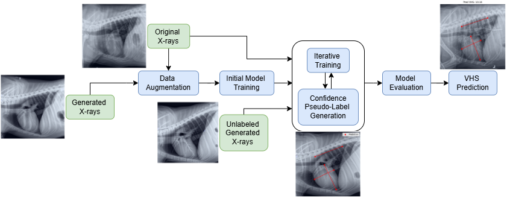
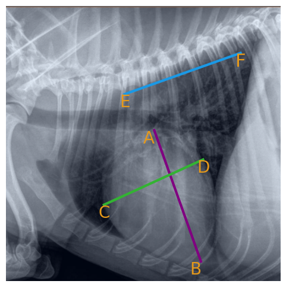
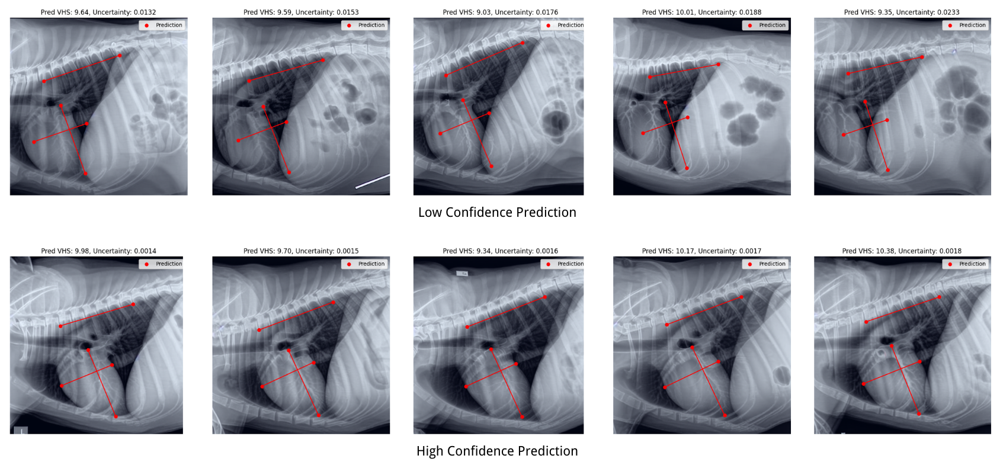
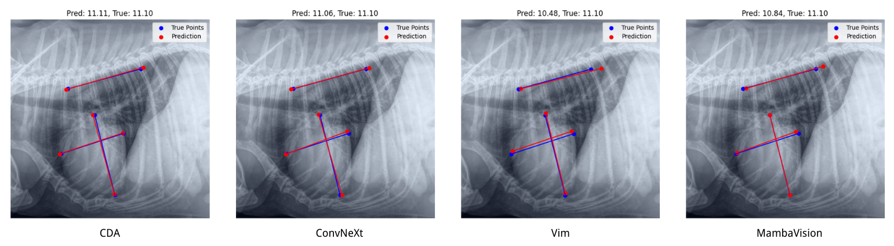

# Confident Pseudo-labeled Diffusion Augmentation for Canine Cardiomegaly Detection

## Overview

This repository contains the implementation of the Confident Pseudo-labeled Diffusion Augmentation (CDA) model, a novel approach for detecting canine cardiomegaly. By integrating synthetic data augmentation with diffusion models, high-confidence pseudo-labeling using Monte Carlo (MC) Dropout, and iterative training, the CDA model achieves state-of-the-art accuracy in Vertebral Heart Score (VHS) prediction and canine cardiomegaly classification.



---

## Features

- **Synthetic Data Augmentation**: Generates anatomically plausible chest X-rays to address data scarcity.
- **Pseudo-labeling with Monte Carlo Dropout**: Leverages high-confidence predictions for iterative training.
- **State-of-the-Art Results**: Achieves 92.8% test accuracy, outperforming existing models.
  
---

## VHS Calculation

The model predicts the Vertebral Heart Score (VHS) using key anatomical landmarks identified in the X-ray. These landmarks are used to compute the VHS based on the following formula:

VHS = 6 * (AB + CD) / EF

### Key Points for VHS Calculation

1. **AB**: Long axis of the heart, measured from the carina to the apex.
2. **CD**: Short axis of the heart, perpendicular to AB at its widest point.
3. **EF**: Length of the vertebral segment, starting from the fourth thoracic vertebra.



---

## High-Confidence vs Low-Confidence Predictions

One of the key features of the Confident Pseudo-labeled Diffusion Augmentation (CDA) model is its ability to differentiate between high-confidence and low-confidence predictions during pseudo-labeling. This ensures only reliable data is incorporated into the training process, improving the model's accuracy and robustness.

The figure below illustrates the comparison between high-confidence and low-confidence predictions:



### Explanation:
- **Top Row (Low-Confidence Predictions):** These predictions have higher uncertainty values, leading to inaccurate key point alignment and less reliable Vertebral Heart Score (VHS) estimations.
- **Bottom Row (High-Confidence Predictions):** These predictions show well-aligned key points and consistent VHS calculations, as their uncertainty values fall below the confidence threshold.

This distinction is achieved using Monte Carlo (MC) Dropout, which enables uncertainty estimation by performing multiple stochastic forward passes through the model during inference. By filtering out low-confidence predictions using a threshold (uncertainty < 0.005), the model ensures only reliable data is incorporated into the training process.

---

## Results

The Confident Pseudo-labeled Diffusion Augmentation (CDA) model demonstrates state-of-the-art performance in predicting Vertebral Heart Score (VHS) and classifying canine cardiomegaly. 

### Performance Comparisons
Our model achieves a test accuracy of **92.8%**, outperforming several baseline models, as shown in the table below:


| Model                     | Valid Acc (%) | Test Acc (%) |
|---------------------------|---------------|--------------|
| ConvNeXt                  | 89.5          | 89.8         |
| Vim                       | 73.5          | 71.5         |
| MambaVision               | 87.5          | 86.8         |
| **CDA w/o Pseudo-labels** | 88.5          | 91.0         |
| **CDA**                   | **89.5**      | **92.8**     |

The CDA model's integration of pseudo-labeling with Monte Carlo Dropout and diffusion-based synthetic data augmentation contributes significantly to these performance improvements.

### Visual Comparison of Predictions
The figure below illustrates a visual comparison of key point predictions made by CDA and other state-of-the-art models.



- **Key Points (CDA in Red):** The CDA model accurately aligns the predicted key points (red) with the ground truth (blue), achieving precise VHS predictions.
- **Baseline Models:** Other models show varying levels of deviation, particularly in key point alignment and VHS estimation.

These results demonstrate the robustness and reliability of the CDA model for VHS prediction and cardiomegaly classification. The integration of pseudo-labeling and synthetic data augmentation significantly enhances model accuracy and generalizability, setting a new benchmark for veterinary diagnostics.

---

## Installation

### Quick Start (Windows PowerShell)

```powershell
git clone https://github.com/ivanmanaos/CDA.git
cd CDA
python -m venv .venv
. .\.venv\Scripts\Activate.ps1
python -m pip install --upgrade pip
pip install -r requirements.txt
```

### Verify Dataset Structure

Assuming real dataset is located at `D:\descargas\Synthetic` (do NOT move files):

```powershell
python tools/verify_dataset.py --data_dir "D:\descargas\Synthetic"
```

### Smoke Training (1 epoch CPU)

```powershell
python scripts/train_initial_cli.py --data_dir "D:\descargas\Synthetic" --epochs 1 --batch_size 2 --image_size 384 --device cpu --out_dir models --seed 42
```

### Full Training Example

```powershell
python scripts/train_initial_cli.py --data_dir "D:\descargas\Synthetic" --splits_json .\outputs\splits_seed42.json --epochs 40 --batch_size 16 --image_size 384 --device cuda --out_dir models --seed 42 --optimizer adamw --weight_decay 0.05 --sched cosine --warmup_epochs 1 --patience 10 --grad_clip 1.0 --amp true
```

### Evaluate and Save CSV

```powershell
python scripts/evaluate_cli.py --data_dir "D:\descargas\Synthetic" --weights .\models\best_initial_model.pth --image_size 384 --device cpu
```

### Single Image Inference

```powershell
python scripts/infer_single.py --weights .\models\best_initial_model.pth --image "D:\descargas\Synthetic\Images\ejemplo1.png" --image_size 384 --device cpu --out_json .\outputs\single_infer.json
```

Create output folders if missing:
```powershell
mkdir models 2>$null; mkdir outputs 2>$null
```

## Directory Structure
The repository is organized as follows:
```bash
src/
|
├── dataset.py          # Dataset loaders for labeled and unlabeled data
├── model.py            # Model definition and VHS calculation
├── initial_train.py    # Initial training script
├── iterative_train.py  # Iterative training with pseudo-labeling
├── pseudo_labeling.py  # High-confidence pseudo-label generation
├── evaluate.py         # Evaluation and inference functions
├── utils.py            # Helper functions
```

## Usage

### Initial Training (Python API)
Train the model with labeled data to obtain the best initial model.
```python
from dataset import DogHeartDataset
from torch.utils.data import DataLoader
from initial_train import train_initial_model
from utils import get_transform

# Load datasets
train_dataset = DogHeartDataset('path/to/train_dataset', transforms=get_transform(512))
valid_dataset = DogHeartDataset('path/to/valid_dataset', transforms=get_transform(512))

train_loader = DataLoader(train_dataset, batch_size=16, shuffle=True)
valid_loader = DataLoader(valid_dataset, batch_size=8, shuffle=False)

# Train the model
device = torch.device('cuda' if torch.cuda.is_available() else 'cpu')
train_initial_model(train_loader, valid_loader, device, num_epochs=1000, lr=3e-4)
```

### Iterative Training with Pseudo-Labeling (Python API)
Refine the model using unlabeled data.
### CLI Arguments Summary (Added)

All main scripts now accept common flags:

| Flag | Description | Default |
|------|-------------|---------|
| --data_dir | Root directory containing `Images/` and `Labels/` | data |
| --epochs | Number of training epochs | script-specific |
| --batch_size | Batch size | script-specific |
| --lr | Learning rate | script-specific |
| --image_size | Resize square dimension (e.g. 384) | 384 |
| --device | cpu or cuda | auto-detect |
| --out_dir | Output directory (models / outputs) | models/ or outputs/ |
| --seed | Random seed | 42 |
| --weights | Path to model weights (for eval/infer) | required where applicable |
| --checkpoint | Path to initial weights (iterative training) | required |
| --mc_passes | # stochastic passes for pseudo-labeling | 20 |
| --threshold | Uncertainty threshold | 0.005 |

Example Windows absolute path usage (note escaping with quotes):
```powershell
python scripts/train_initial_cli.py --data_dir "D:\descargas\Synthetic" --epochs 1 --batch_size 2 --image_size 384 --device cpu --out_dir models
```

If labels format differs from expected keys `six_points` and `VHS`, use placeholder converter:
```powershell
python tools/convert_labels.py --in_dir "D:\descargas\Synthetic\Labels" --out_dir "D:\descargas\Synthetic\Labels"
```
### Splits + Métricas

Crear splits persistentes (agrupando variantes por ID) y entrenar/evaluar con ellos sin mover el dataset real `D:\descargas\Synthetic`:

```powershell
python tools/make_splits.py --data_dir "D:\descargas\Synthetic" --val_ratio 0.15 --test_ratio 0.15 --seed 42 --group_by_id true --out_json .\outputs\splits_seed42.json
```

Entrenamiento usando sólo los archivos listados en el split (train/val):
```powershell
python scripts/train_initial_cli.py --data_dir "D:\descargas\Synthetic" --splits_json .\outputs\splits_seed42.json --epochs 5 --batch_size 16 --image_size 384 --device cpu --out_dir models --seed 42
```

Evaluación (TEST) con métricas y matriz de confusión:
```powershell
python scripts/evaluate_cli.py --data_dir "D:\descargas\Synthetic" --splits_json .\outputs\splits_seed42.json --use_split test --weights .\models\cda_b7_best_mae.pth --image_size 384 --device cuda --out_csv .\outputs\test_preds.csv --metrics_out .\outputs\test_metrics.json --confusion_out .\outputs\test_confusion.png --tta 1 --mc_passes 0
```

Linux (ejemplo CPU, offline sin pretrained):
```bash
python3 tools/make_splits.py --data_dir "/RUTA/AL/DATASET" --val_ratio 0.15 --test_ratio 0.15 --seed 42 --group_by_id true --out_json ./outputs/splits_seed42.json
python3 scripts/train_initial_cli.py --data_dir "/RUTA/AL/DATASET" --splits_json ./outputs/splits_seed42.json --epochs 40 --batch_size 16 --image_size 384 --device cpu --out_dir models --seed 42 --pretrained false --optimizer adamw --weight_decay 0.05 --sched cosine --warmup_epochs 1 --patience 10 --grad_clip 1.0 --amp false
python3 scripts/evaluate_cli.py --data_dir "/RUTA/AL/DATASET" --splits_json ./outputs/splits_seed42.json --use_split test --weights ./models/cda_b7_best_mae.pth --image_size 384 --device cpu --out_csv ./outputs/test_preds.csv --metrics_out ./outputs/test_metrics.json --confusion_out ./outputs/test_confusion.png --pretrained false --tta 1 --mc_passes 0
```

Métricas generadas (JSON): `MAE`, `RMSE`, `accuracy`, `macro_f1`, soporte por clase. CSV incluye VHS_gt/pred y clases. PNG: matriz de confusión.

Nota offline: usar `--pretrained false` en sistemas sin Internet para evitar descarga de pesos.

### Chequeo de leakage entre splits

Antes de entrenar final, verificar que no haya intersección entre train/val/test:
```powershell
python tools/check_split_leakage.py --splits_json .\outputs\splits_seed42.json
```

### Nombres de checkpoints (final training)

El mejor modelo (mínimo MAE en validación) se guarda como:
```
models/cda_b7_best_maeXXXX_epochYY.pth  (detalle con MAE y epoch)
models/cda_b7_best_mae.pth              (alias estable del mejor actual)
models/cda_b7_last.pth                  (último epoch luego de early stopping o fin)
```
Log de entrenamiento y curva:
```
outputs/training_log.csv
outputs/training_plot.png
```

Flags clave agregados: `--patience`, `--optimizer`, `--weight_decay`, `--sched`, `--warmup_epochs`, `--grad_clip`, `--amp`, `--num_workers`, `--pretrained`.

Early stopping se activa si `val_mae` no mejora tras `--patience` epochs.
```python
from dataset import DogHeartDataset, DogHeartTestDataset
from torch.utils.data import DataLoader
from iterative_train import train_with_pseudo_labels
from utils import get_transform

train_dataset = DogHeartDataset('path/to/train_dataset', transforms=get_transform(512))
unlabeled_dataset = DogHeartTestDataset('path/to/unlabeled_dataset', transforms=get_transform(512))
valid_dataset = DogHeartDataset('path/to/valid_dataset', transforms=get_transform(512))

train_loader = DataLoader(train_dataset, batch_size=16, shuffle=True)
unlabeled_loader = DataLoader(unlabeled_dataset, batch_size=16, shuffle=False)
valid_loader = DataLoader(valid_dataset, batch_size=8, shuffle=False)

checkpoint_path = '/path/to/best_initial_model_checkpoint.pth'
checkpoint = torch.load(checkpoint_path, map_location=device, weights_only=True)

device = torch.device('cuda' if torch.cuda.is_available() else 'cpu')
train_with_pseudo_labels(train_loader, unlabeled_loader, valid_loader, checkpoint, device, num_epochs=100, lr=1e-5)
```

### Dataset
2,000 Original Dataset: [Download](https://yuad-my.sharepoint.com/:f:/g/personal/youshan_zhang_yu_edu/ErguFJBE4y9KqzEdWWNlXzMBkTbsBaNX9l856SyvQauwJg?e=hp9bY7)

3,000 Synthetic Dataset: [Download](https://drive.google.com/file/d/1qMUyOw4yl-ps7tzOQZJGDnatH_V2VfVI/view?usp=drive_link)


---

## API Local (Inferencia HTTP)

Exponer el script `scripts/infer_single.py` como servicio HTTP para que otra máquina en la misma red envíe una imagen y reciba el JSON de inferencia.

### Arranque del servidor

```bash
source .venv/bin/activate
pip install -r requirements.txt  # asegura flask/werkzeug
python server_ia.py              # * Running on http://0.0.0.0:5001
```

Variables de entorno opcionales:
- `PORT` (default 5001)
- `DEVICE` (cpu | cuda, default cpu)
- `WEIGHTS` (ruta alternativa a ./models/cda_b7_best_mae.pth)
- `IMAGE_SIZE` (default 384)
- `CORS_ORIGIN` (default `*`)

### Endpoints

`GET /health` → `{ "ok": true }`

`POST /infer` (multipart/form-data, campo `image`) → JSON de salida del script (incluye `VHS_pred`, `class_pred`, `label`, `healthy`, `thresholds`, `points_pred`, etc.)

Ejemplo (desde otra PC):
```bash
curl -F "image=@/home/ivan/Downloads/Synthetic/Images/heart_21_0.png" http://<IP_LINUX>:5001/infer
```

Si falla: verificar que ambas máquinas estén en la misma red y no haya client isolation del hotspot.

### Snippet cliente JS
```javascript
async function infer(imgFile) {
	const fd = new FormData();
	fd.append('image', imgFile);
	const r = await fetch('http://<IP_LINUX>:5001/infer', { method: 'POST', body: fd });
	if (!r.ok) throw new Error('HTTP ' + r.status);
	return await r.json();
}
```

### Notas Técnicas
- Guarda imagen y JSON en directorio temporal.
- Usa `secure_filename` para sanitizar el nombre.
- Respuestas con `application/json`.
- Errores: `400` si falta archivo, `500` si subprocess falla (stderr truncado).
- CORS simple: header `Access-Control-Allow-Origin`.
- No modifica el modelo ni el script de inferencia interno.

